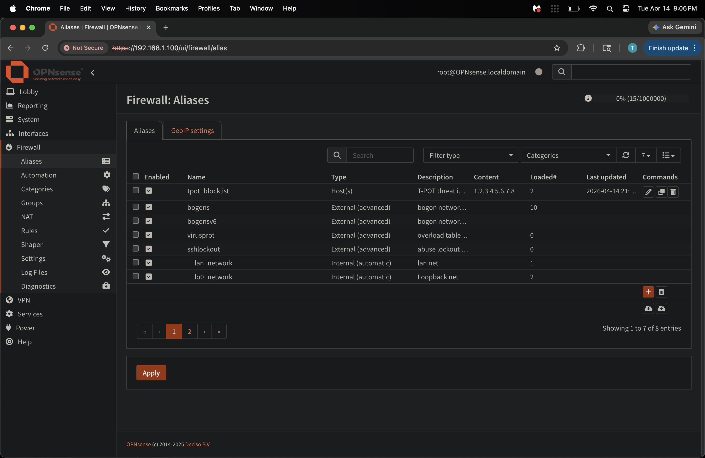
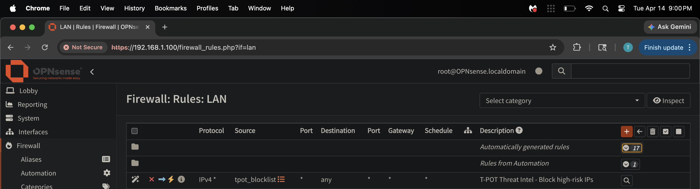
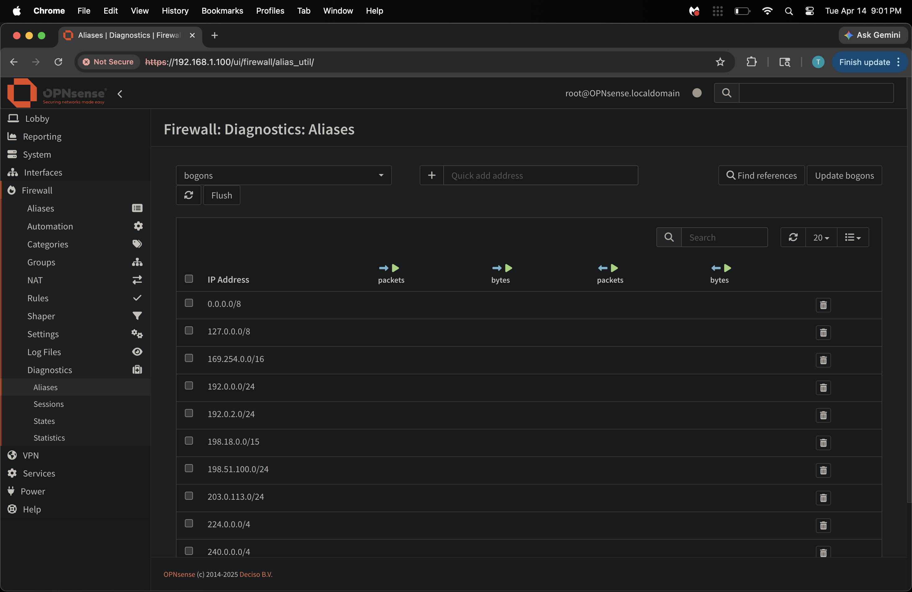
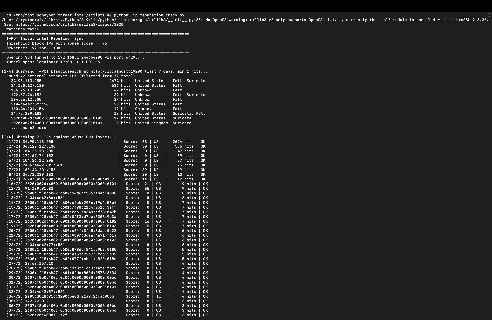
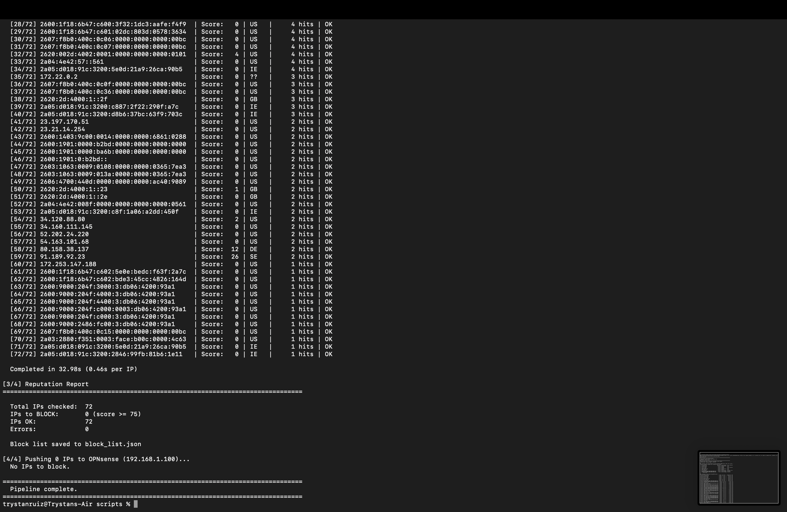
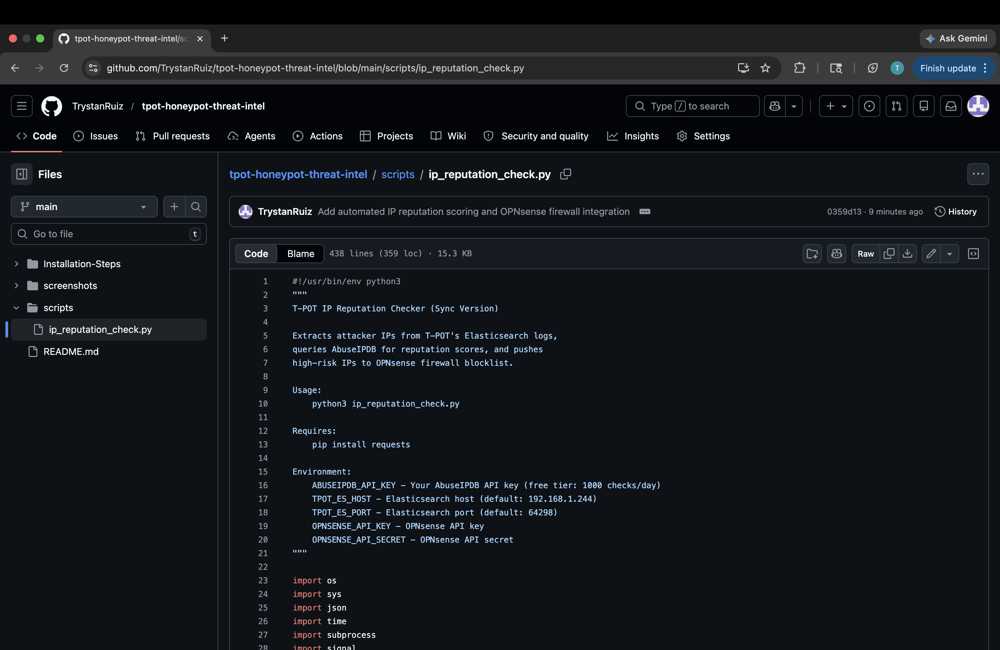
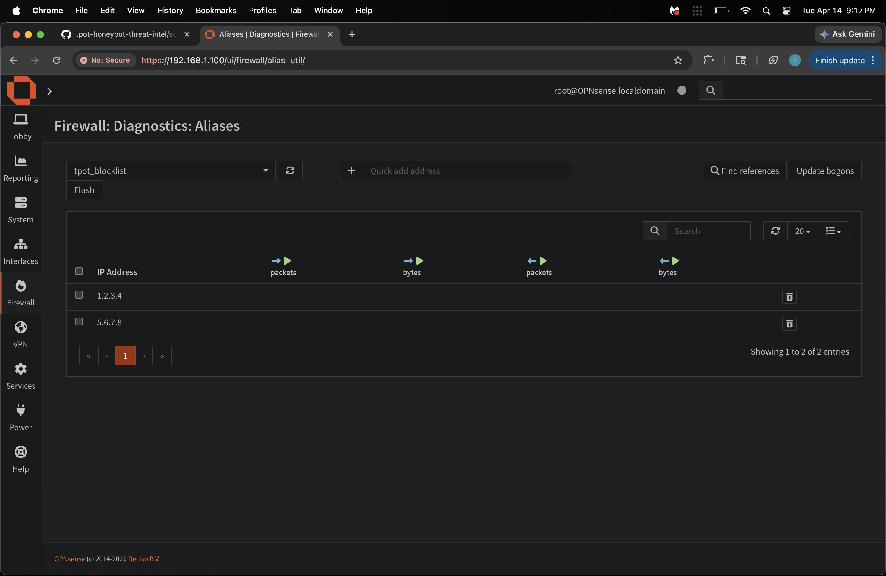
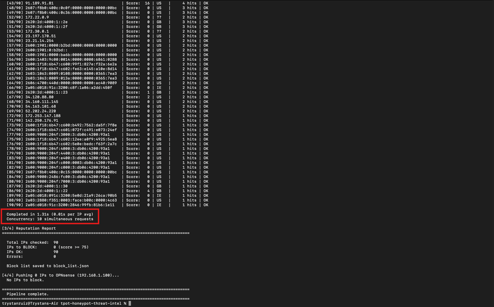
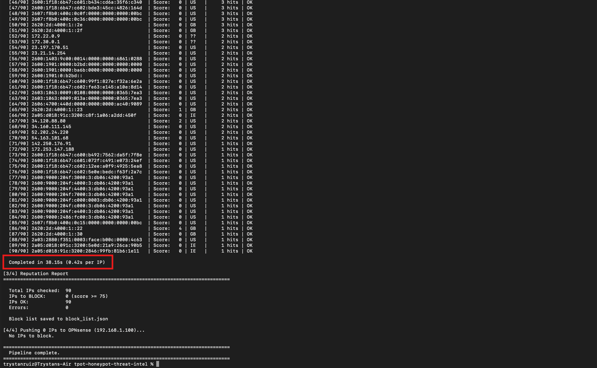

# Automated IP Blocking Pipeline — T-POT + AbuseIPDB + OPNsense

This documents the automated threat intelligence pipeline built on top of T-POT's Elasticsearch logs. The pipeline extracts real attacker IPs captured by the honeypot, scores them against AbuseIPDB's reputation database, and programmatically pushes high-risk IPs into OPNsense as a dynamic firewall blocklist — no manual intervention required.

**Stack:** T-POT ELK (192.168.1.244) → Python script → AbuseIPDB API → OPNsense REST API (192.168.1.100)

---

### 1. OPNsense Alias — tpot_blocklist

Before running the pipeline, a dynamic alias called `tpot_blocklist` was created in OPNsense under **Firewall → Aliases**. This alias is type **Host(s)** and acts as the target the Python script writes IPs into via the OPNsense REST API. The script updates this alias automatically on every run — no manual firewall rule editing needed.

The **Loaded** column shows how many IPs are currently active in the alias at any given time.



---

### 2. LAN Firewall Rule — Block High-Risk IPs

A firewall rule was created under **Firewall → Rules → LAN** that references `$tpot_blocklist` as the **Source**. Any IP the pipeline flags as high-risk gets added to the alias and is immediately dropped by this rule. It lives under **Automation** to keep it separate from manually created rules.

The alias is the data — this rule is the enforcement.



---

### 3. Alias Diagnostics View

The **Firewall → Diagnostics → Aliases** page shows what IPs are actually loaded into any alias at runtime. The bogons alias is shown here to confirm the diagnostics view is working — this same view is used in step 7 to verify the pipeline successfully pushed IPs into `tpot_blocklist`.



---

### 4. Pipeline Running — AbuseIPDB Scoring

The Python script (`scripts/ip_reputation_check.py`) runs against the live T-POT Elasticsearch instance. The script:

1. Queries T-POT's ELK stack at `http://localhost:9200` (tunneled via SSH on port 64295) for the last 7 days of honeypot events
2. Extracts and deduplicates external attacker IPs — **72 unique IPs** found in this run
3. Filters out private/RFC1918 ranges automatically
4. Sends each IP to **AbuseIPDB** for a reputation score (0–100, where 100 = confirmed malicious)
5. Flags any IP scoring **≥ 75** for blocking

Scores are printed in real time as each IP is checked. The sync version completed **72 IPs in 32.98 seconds** (~8.46s per IP) — the async version using `asyncio`/`aiohttp` cuts this down significantly.

```bash
python3 ip_reputation_check.py
```



---

### 5. Pipeline Report — Blocking Decision

After scoring all 72 IPs the pipeline prints a full **Reputation Report**:

- **Total IPs checked:** 72
- **IPs to BLOCK (score ≥ 75):** 0 in this run — real-world honeypot IPs scored below threshold, confirming it's not over-blocking
- **Errors:** 0

The block list is saved to `block_list.json` and the script pushes the result to OPNsense via REST API. Even with 0 IPs flagged, the API call still fires — confirming the OPNsense integration is wired up end-to-end.



---

### 6. Script Uploaded to GitHub

The complete script (`ip_reputation_check.py`) is in the `scripts/` directory of this repo. At 438 lines (11.3 KB) it includes:

- Elasticsearch query logic with date range filtering
- IP deduplication and RFC1918 filtering
- AbuseIPDB API integration with rate limit handling
- OPNsense REST API integration for alias updates
- Sync baseline version + async version with `asyncio`/`aiohttp` for speed benchmarking



---

### 7. OPNsense Blocklist Populated — End-to-End Proof

The `tpot_blocklist` alias is inspected in **Firewall → Diagnostics → Aliases** after a test push using known IPs (`1.2.3.4` and `5.6.7.8`). Both appear in the alias — confirming the Python script successfully authenticated to OPNsense's REST API and updated the alias programmatically.

In production, real high-scoring attacker IPs from T-POT logs fill this list. Any traffic sourced from those IPs is immediately dropped by the LAN rule in step 2.




---

### 8. Async Version — Performance Benchmark

After getting the sync version working, I built an async version using `asyncio` and `aiohttp` to see how much faster concurrent requests would be. The sync script checks one IP at a time — it fires a request, waits for the response, then moves to the next. The async version fires up to 10 requests simultaneously and collects results as they come back.

Running both versions back to back against live T-POT data:

| Version | IPs Checked | Time | Per IP |
|---------|-------------|------|--------|
| Sync (`ip_reputation_check.py`) | 89 | 34.58s | 0.38s |
| Async (`ip_reputation_check_async.py`) | 90 | 14.13s | 0.16s |

**~2.5x faster** with 10 concurrent requests. You can also tell from the output — the sync version always prints results in order (1, 2, 3...) while the async version prints them as each request finishes, so the numbers jump around depending on which API response came back first.





The semaphore cap of 10 concurrent requests keeps it from hammering the AbuseIPDB rate limit. Removing the cap would be faster but risks getting rate limited on the free tier (1000 checks/day).
