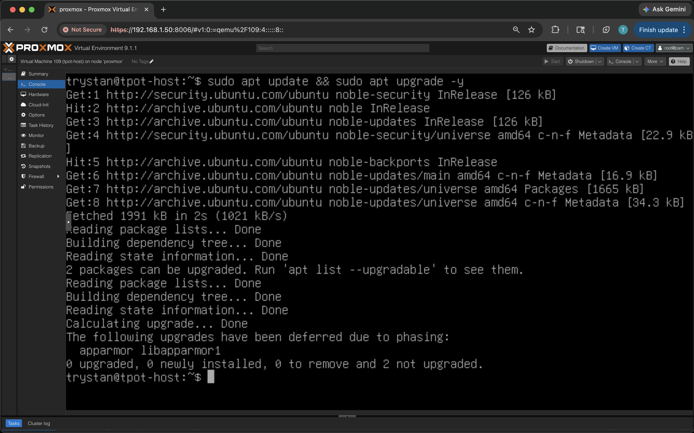
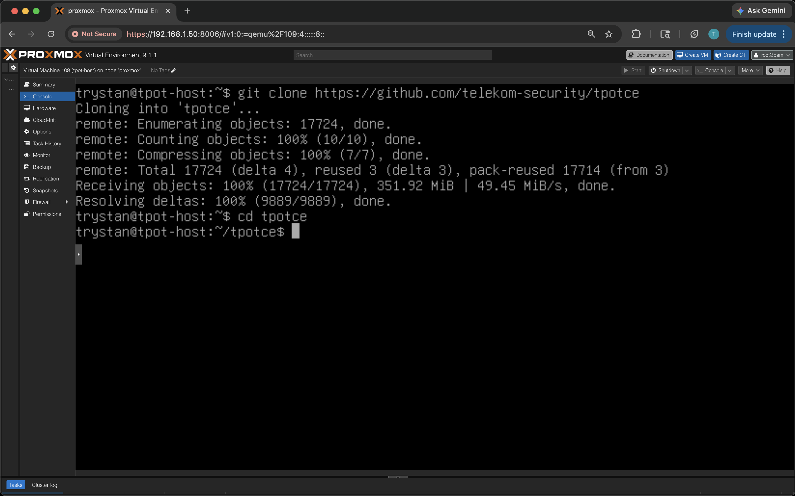
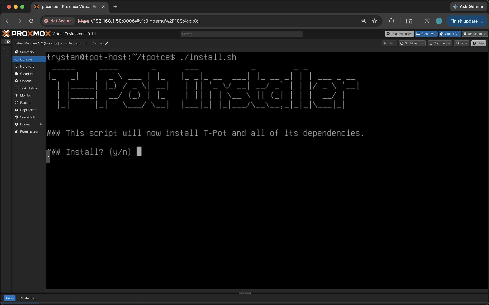
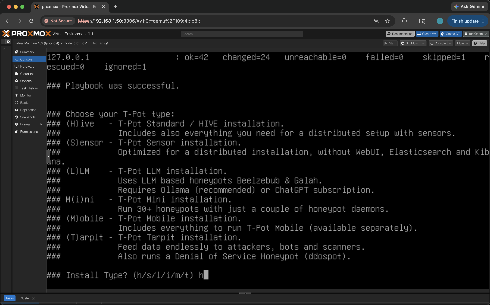
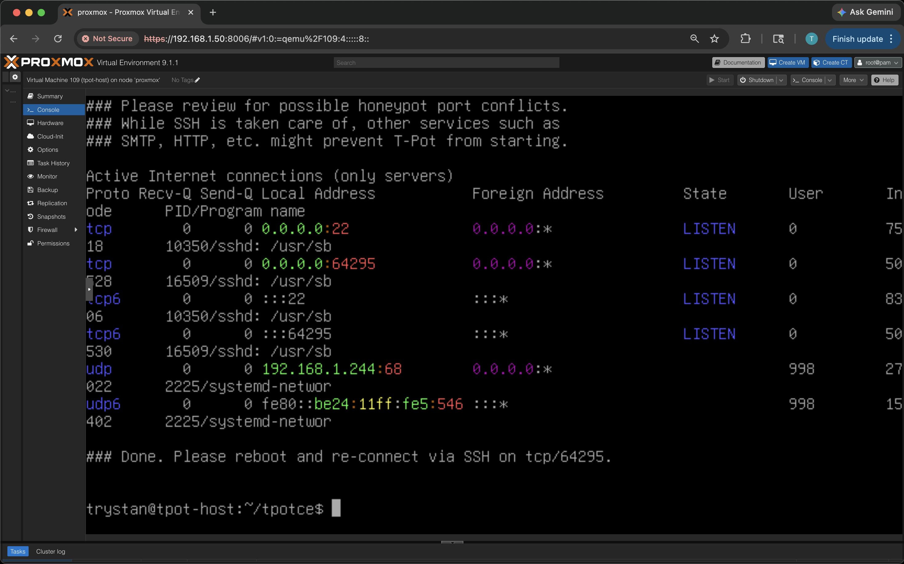

# T-Pot Installation

### 1. Update the system

Starting on a fresh Ubuntu 24.04 LTS cloud image provisioned on Proxmox with cloud-init. First step is updating all packages before installing anything.

```bash
sudo apt update && sudo apt upgrade -y
```



### 2. Clone the T-Pot repository

Cloning the official T-Pot repo from Deutsche Telekom Security on GitHub and navigating into it.

```bash
git clone https://github.com/telekom-security/tpotce
cd tpotce
```



### 3. Run the installer

Running the T-Pot install script. It installs Docker, pulls all honeypot container images, sets up the ELK stack, configures networking, and handles all dependencies through an Ansible playbook.

```bash
./install.sh
```



### 4. Choose the installation type

After the Ansible playbook finishes, the installer asks which T-Pot edition to deploy. Selected **(H)ive - T-Pot Standard** which includes the full set of 20+ honeypot sensors, Suricata IDS, and the complete ELK stack with Kibana dashboards.

Available options:
- **(H)ive** - Standard. Full honeypot suite with ELK and web UI
- **(S)ensor** - Distributed sensor, no local ELK
- **(L)LM** - LLM-based honeypots (Beelzebub, Galah)
- **M(i)ni** - Minimal, 30+ honeypots with fewer daemons
- **(M)obile** - Mobile deployment
- **(T)arpit** - Tarpit mode, feeds attackers endlessly



### 5. Installation complete

T-Pot finishes installing and displays a port conflict review. SSH has been moved from port 22 to port **64295** since Cowrie now takes over port 22 as a honeypot. The installer prompts to reboot and reconnect on the new SSH port.

After reboot:
- SSH access on port **64295**
- T-Pot web UI / Kibana at **https://\<ip\>:64297**
- Attack Map at **https://\<ip\>:64294**
- 39 Docker containers running across isolated bridge networks

```bash
ssh -p 64295 <user>@<ip>
```


