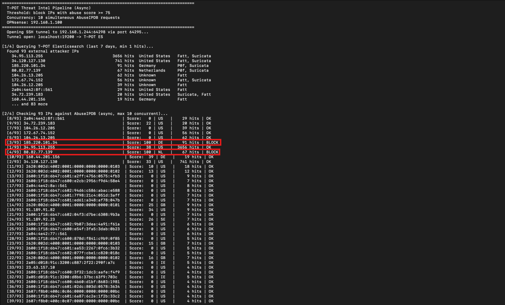
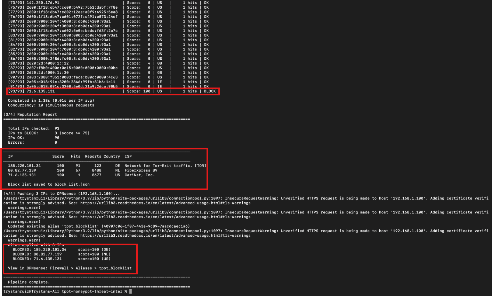

# Live Threat Blocking — Known Malicious IPs

This documents a live end-to-end test of the automated blocking pipeline using known malicious IPs. Three IPs confirmed at AbuseIPDB score 100 were spoofed as attack sources against T-POT. The pipeline detected them, scored them, and pushed them to OPNsense — no manual intervention.

---

### IPs Used

| IP | Score | ISP | Notes |
|----|-------|-----|-------|
| `185.220.101.34` | 100 | Network for Tor-Exit traffic | TOR exit node, 123 reports |
| `80.82.77.139` | 100 | FiberXpress BV | Known mass scanner, 8,488 reports |
| `71.6.135.131` | 100 | CariNet, Inc. | Known scanner, 8,677 reports |

---

### Step 1 — Simulate Attack Traffic from Kali

`hping3` was used to send spoofed SYN packets to T-POT's honeypot ports with each known bad IP set as the source. The packets hit real honeypot listeners — T-POT doesn't care about the handshake, it logs the source IP on first contact.

```bash
sudo hping3 -S -p 22 -a 185.220.101.34 192.168.1.244 -c 100
sudo hping3 -S -p 23 -a 80.82.77.139 192.168.1.244 -c 100
sudo hping3 -S -p 80 -a 71.6.135.131 192.168.1.244 -c 100
```

100% packet loss on Kali's end is expected — the SYN-ACKs go back to the spoofed source, not Kali. The important thing is T-POT received and logged them.

---

### Step 2 — Pipeline Detection and Scoring

After the traffic hit T-POT, the async pipeline was run. It pulled 93 unique IPs from Elasticsearch, checked all of them against AbuseIPDB in 1.46 seconds, and flagged the three spoofed IPs for blocking.

```
Total IPs checked:  93
IPs to BLOCK:        3 (score >= 75)
IPs OK:             90
```

All three scored 100 — maximum confidence malicious.



---

### Step 3 — OPNsense Blocklist Updated

The pipeline pushed all three IPs to OPNsense via REST API, updating the `tpot_blocklist` alias automatically. Any traffic sourced from these IPs is now dropped at the firewall.



---

> Full pipeline details: [Automated-IP-Blocking-Pipeline.md](Automated-IP-Blocking-Pipeline.md)
